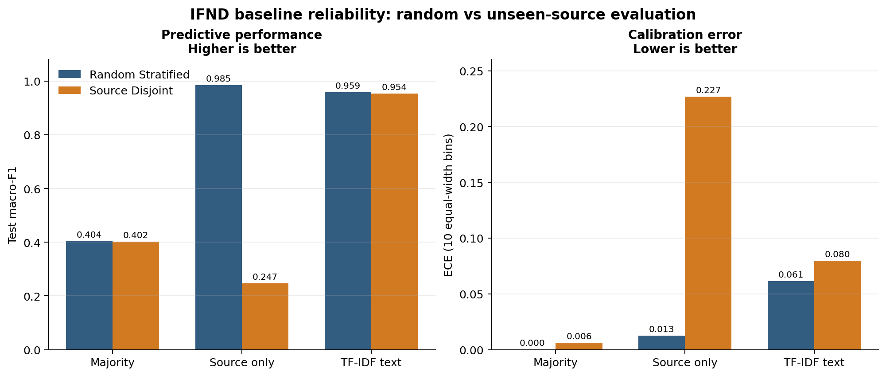

# Misinformation Classification Reliability

[](#evidence-status)
[](#reproduction)

This repository reconstructs Naazreen Tabassum's MSc dissertation, **Fake News
Detection through Deep Learning**, as an auditable machine-learning research
artifact. The first verified release focuses on a more basic question that must
be answered before comparing neural architectures:

> How much does a conventional random split overestimate misinformation-classifier
> performance when publisher/source and near-duplicate leakage are controlled?

The repository preserves the legacy Colab code for provenance, but does not
treat notebook outputs or dissertation tables as reproduced results. New claims
are generated only from configuration-driven runs with saved splits,
predictions, metrics, and run metadata.

## Evidence status

| Component | Status | Meaning |
|---|---|---|
| Dissertation and original Colab | Legacy evidence | Inspected and preserved; historical claims are not independently reproduced |
| IFND data audit | Verified locally | Schema, checksum, missingness, duplicates, and source-label association were recomputed from the supplied CSV |
| Deterministic baselines | Verified single-seed v0.1 | Random and source-disjoint results were recomputed from saved predictions |
| FNN, CNN, LSTM, BERT comparison | Planned reconstruction | Architectures and tuning budgets require a clean, separately validated implementation |
| Publication claims | Not ready | No novelty, state-of-the-art, or deployment claim is made |

## Why the original headline accuracy is not yet a research claim

The supplied IFND file has 56,714 rows from 29 recorded sources. In the full
file, predicting each source's majority label is correct for approximately
98.49% of rows. Many sources contain only one label. A random record-level
split can therefore retain source-specific writing patterns in both train and
test sets. The file also contains normalized duplicate statements, including
conflicting-label and cross-source groups.

These observations do not invalidate the dissertation effort. They identify
the central reliability problem that the reconstruction will test directly.
See [the reconstruction audit](docs/reconstruction_audit.md) for the exact
evidence boundary.

## First verified baseline result

| Protocol | TF-IDF test macro-F1 | Accuracy | Brier | ECE-10 |
|---|---:|---:|---:|---:|
| Random stratified | 0.9591 | 0.9647 | 0.0343 | 0.0612 |
| Source-disjoint | 0.9541 | 0.9593 | 0.0384 | 0.0798 |

Under this single selected source holdout, predictive performance drops only
slightly while calibration worsens. The source-only diagnostic collapses from
0.9846 to 0.2473 macro-F1, confirming that source identity itself does not
transfer to unseen publishers. These are verified baseline observations, not a
final hypothesis test: multiple source holdouts and confidence intervals are
still required. See [the generated result record](reports/results/README.md).



## Reproduction

### 1. Prepare the environment

Tested reconstruction environment: Python 3.12.

```bash
python -m venv .venv
source .venv/bin/activate
python -m pip install --upgrade pip
python -m pip install -e .
```

Windows PowerShell activation:

```powershell
.venv\Scripts\Activate.ps1
```

### 2. Place the dataset

Obtain the IFND dataset under its applicable terms and place it at:

```text
data/raw/IFND.csv
```

The expected SHA-256 checksum for the researcher-supplied copy is:

```text
fafbb516c5d78a26ed1cfdf5077f989eae24c1258ad3c4de731ac6d6932505d6
```

The raw CSV is deliberately excluded from Git because its exact public source
URL and redistribution licence still require verification.

### 3. Audit the data

```bash
python scripts/audit_data.py --data data/raw/IFND.csv --output reports/data_audit.json
```

### 4. Run a quick smoke experiment

```bash
python scripts/run_experiment.py --data data/raw/IFND.csv --config configs/smoke.json
```

### 5. Reproduce the deterministic baselines

```bash
python scripts/run_experiment.py --data data/raw/IFND.csv --config configs/random_stratified.json
python scripts/run_experiment.py --data data/raw/IFND.csv --config configs/source_disjoint.json
```

Or run the complete audit, both protocols, independent metric verification,
aggregation, and figure generation with one command:

```bash
python scripts/reproduce_baselines.py --data data/raw/IFND.csv
```

Each run writes a unique directory under `artifacts/` containing the resolved
configuration, split assignments, per-example predictions, long-form metrics,
and a run record with the data checksum and software/system metadata.

### 6. Run tests

```bash
python -m unittest discover -s tests -v
```

## Current experimental contract

- **Primary metric:** macro-F1 on the locked test split.
- **Secondary metrics:** accuracy, balanced accuracy, per-class precision/recall,
  Brier score, log loss, and expected calibration error.
- **Comparators:** majority class, source-only logistic regression (diagnostic),
  and TF-IDF logistic regression.
- **Leakage controls:** normalized-text conflict removal, one retained record per
  normalized statement, immutable split assignments, and source-disjoint groups.
- **Seed:** fixed and stored in every configuration and run record.
- **Non-goal:** this is not a truth detector or a deployment-ready moderation system.

Full prespecification is in [RESEARCH_CONTRACT.md](RESEARCH_CONTRACT.md).

## Repository map

```text
configs/                         Versioned experiment configurations
data/manifests/                  Dataset provenance and checksum record
data/raw/                        Local raw data; never committed
docs/                            Reconstruction audit and limitations
notebooks/archive/               Output-stripped legacy Colab notebook
src/misinformation_reliability/  Reusable data, split, model, and metric code
scripts/                         Audit, experiment, analysis, and notebook tools
tests/                           Leakage, splitting, metric, and smoke tests
artifacts/                       Generated run records and predictions
reports/results/                 Verified aggregate tables derived from artifacts
```

## Responsible use

Dataset labels reflect the construction choices of the underlying sources and
do not establish objective truth. Models may learn publisher, topic, period,
or annotation artifacts. Do not use this code to make decisions about people,
remove content, or automate fact-checking without independent evidence,
domain review, and appropriate safeguards.

## Citation and licence

Code is released under the [MIT License](LICENSE). Dataset and pretrained-model
terms are separate. Citation metadata is provided in [CITATION.cff](CITATION.cff).
