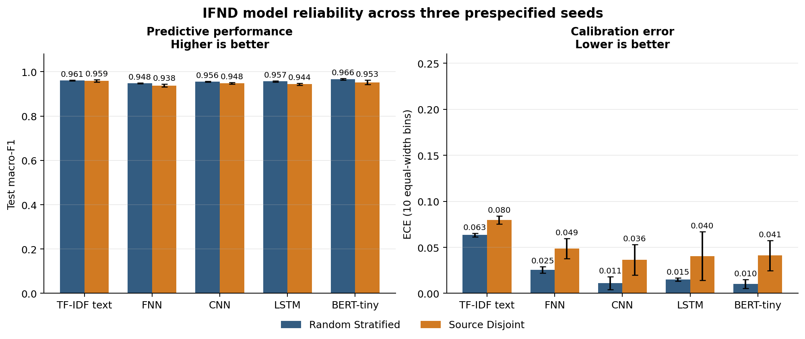

# Misinformation Classification Reliability

[](#evidence-status)
[](#reproduction)

This repository reconstructs Naazreen Tabassum's MSc dissertation, **Fake News
Detection through Deep Learning**, as an auditable machine-learning research
artifact. The verified reconstruction tests a reliability question across a
classical baseline and four neural model families:

> How much does a conventional random split overestimate misinformation-classifier
> performance when publisher/source and near-duplicate leakage are controlled?

The repository preserves the legacy Colab code for provenance, but does not
treat notebook outputs or dissertation tables as reproduced results. New claims
are generated only from configuration-driven runs with saved splits,
predictions, metrics, and run metadata.

## Evidence status

| Component | Status | Meaning |
|---|---|---|
| Dissertation and original Colab | Legacy evidence | Inspected and preserved; historical claims are not independently reproduced |
| IFND data audit | Verified locally | Schema, checksum, missingness, duplicates, and source-label association were recomputed from the supplied CSV |
| TF-IDF, FNN, CNN, LSTM, BERT-tiny | Verified repeated-seed v0.2 | Three prespecified seeds per protocol; all metrics were recomputed from saved predictions |
| Source-disjoint holdouts | Verified | Each seed selects a distinct publisher test block, shared by every model family for that seed |
| Dataset acquisition | Documented with rights warning | Exact Kaggle card and checksum recorded; licence remains `Unknown`, so the CSV is not redistributed |
| Publication claims | Evidence-limited | No novelty, state-of-the-art, statistical-significance, or deployment claim is made |

## Why the original headline accuracy is not yet a research claim

The supplied IFND file has 56,714 rows from 29 recorded sources. In the full
file, predicting each source's majority label is correct for approximately
98.49% of rows. Many sources contain only one label. A random record-level
split can therefore retain source-specific writing patterns in both train and
test sets. The file also contains normalized duplicate statements, including
conflicting-label and cross-source groups.

These observations do not invalidate the dissertation effort. They identify
the central reliability problem that the reconstruction will test directly.
See [the reconstruction audit](docs/reconstruction_audit.md) for the exact
evidence boundary.

## Verified repeated-seed result

Test values are mean ± sample standard deviation over seeds 13, 42, and 87.

| Model | Random macro-F1 | Source-disjoint macro-F1 | Random accuracy | Source-disjoint accuracy | Random ECE-10 | Source-disjoint ECE-10 |
|---|---:|---:|---:|---:|---:|---:|
| TF-IDF logistic | 0.9609 ± 0.0017 | **0.9594 ± 0.0051** | 0.9662 ± 0.0014 | **0.9642 ± 0.0043** | 0.0634 ± 0.0020 | 0.0798 ± 0.0043 |
| FNN | 0.9485 ± 0.0023 | 0.9381 ± 0.0066 | 0.9551 ± 0.0021 | 0.9450 ± 0.0053 | 0.0254 ± 0.0035 | 0.0486 ± 0.0109 |
| CNN | 0.9558 ± 0.0021 | 0.9480 ± 0.0035 | 0.9617 ± 0.0020 | 0.9544 ± 0.0028 | 0.0113 ± 0.0069 | 0.0364 ± 0.0167 |
| LSTM | 0.9566 ± 0.0029 | 0.9444 ± 0.0047 | 0.9625 ± 0.0025 | 0.9509 ± 0.0047 | 0.0150 ± 0.0017 | 0.0404 ± 0.0264 |
| BERT-tiny | **0.9662 ± 0.0034** | 0.9526 ± 0.0098 | **0.9705 ± 0.0030** | 0.9576 ± 0.0090 | **0.0103 ± 0.0047** | 0.0411 ± 0.0163 |

BERT-tiny leads the random-split mean; TF-IDF leads the source-disjoint mean.
All four neural families have lower mean macro-F1 and higher mean ECE on the
source-disjoint holdouts. The source-only diagnostic falls from 0.9852 ± 0.0019
to 0.2452 ± 0.0038 macro-F1. These are descriptive results from three selected
holdouts, not evidence of statistical significance. See
[the generated result record](reports/results/README.md).



## Reproduction

### 1. Prepare the environment

Tested reconstruction environment: Python 3.12.

```bash
python -m venv .venv
source .venv/bin/activate
python -m pip install --upgrade pip
python -m pip install -r requirements-neural-cpu.txt
python -m pip install -e . --no-deps
```

Windows PowerShell activation:

```powershell
.venv\Scripts\Activate.ps1
```

### 2. Place the dataset

Obtain the IFND dataset under its applicable terms and place it at:

```text
data/raw/IFND.csv
```

The expected SHA-256 checksum for the researcher-supplied copy is:

```text
fafbb516c5d78a26ed1cfdf5077f989eae24c1258ad3c4de731ac6d6932505d6
```

The raw CSV is deliberately excluded from Git. Its Kaggle data card currently
shows licence `Unknown`; follow [the authorised acquisition and checksum
instructions](data/README.md) rather than redistributing the file.

### 3. Audit the data

```bash
python scripts/audit_data.py --data data/raw/IFND.csv --output reports/data_audit.json
```

### 4. Run a quick smoke experiment

```bash
python scripts/run_experiment.py --data data/raw/IFND.csv --config configs/smoke.json
```

### 5. Reproduce the full evidence matrix

```bash
python scripts/reproduce_matrix.py --data data/raw/IFND.csv
```

This one command runs all five model families under both protocols for seeds
13, 42, and 87; independently recomputes saved metrics; and regenerates the
aggregate tables and figure. The recorded CPU runs took roughly 60 minutes in
total on a nine-core Linux environment. Runtime varies substantially by
hardware, and the pinned BERT checkpoint must be downloadable on the first run.

For the faster classical-only matrix:

```bash
python scripts/reproduce_matrix.py --data data/raw/IFND.csv --skip-neural
```

Each run writes a unique directory under `artifacts/` containing the resolved
configuration, split assignments, per-example predictions, long-form metrics,
and a run record with the data checksum and software/system metadata.

### 6. Run tests

```bash
python -m unittest discover -s tests -v
```

## Current experimental contract

- **Primary metric:** macro-F1 on the locked test split.
- **Secondary metrics:** accuracy, balanced accuracy, per-class precision/recall,
  Brier score, log loss, and expected calibration error.
- **Primary model families:** TF-IDF logistic regression, FNN, CNN, LSTM, and
  pinned BERT-tiny.
- **Diagnostics:** majority class and source-only logistic regression.
- **Leakage controls:** normalized-text conflict removal, one retained record per
  normalized statement, immutable split assignments, and source-disjoint groups.
- **Seeds:** 13, 42, and 87; stored in every configuration and run record.
- **Uncertainty:** sample mean and standard deviation across the three seeds;
  no statistical-significance claim is made.
- **Non-goal:** this is not a truth detector or a deployment-ready moderation system.

Full prespecification is in [RESEARCH_CONTRACT.md](RESEARCH_CONTRACT.md).

## Repository map

```text
configs/                         Versioned experiment configurations
data/manifests/                  Dataset provenance and checksum record
data/raw/                        Local raw data; never committed
docs/                            Reconstruction audit and limitations
notebooks/archive/               Output-stripped legacy Colab notebook
src/misinformation_reliability/  Reusable data, split, model, and metric code
scripts/                         Audit, experiment, analysis, and notebook tools
tests/                           Leakage, splitting, metric, and smoke tests
artifacts/                       Generated run records and predictions
reports/results/                 Verified aggregate tables derived from artifacts
```

## Responsible use

Dataset labels reflect the construction choices of the underlying sources and
do not establish objective truth. Models may learn publisher, topic, period,
or annotation artifacts. Do not use this code to make decisions about people,
remove content, or automate fact-checking without independent evidence,
domain review, and appropriate safeguards.

## Citation and licence

Code is released under the [MIT License](LICENSE). Dataset and pretrained-model
terms are separate. Citation metadata is provided in [CITATION.cff](CITATION.cff).
